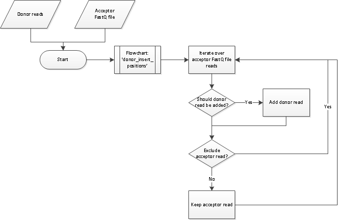
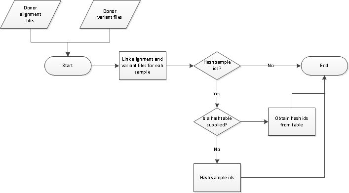
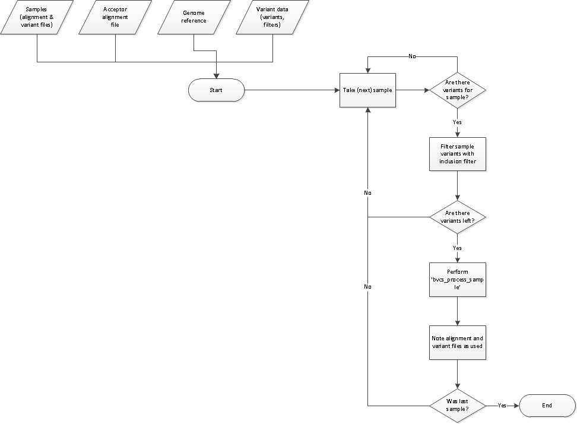
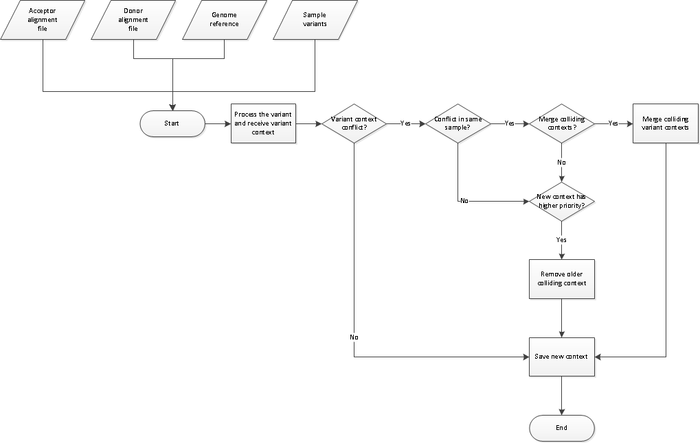
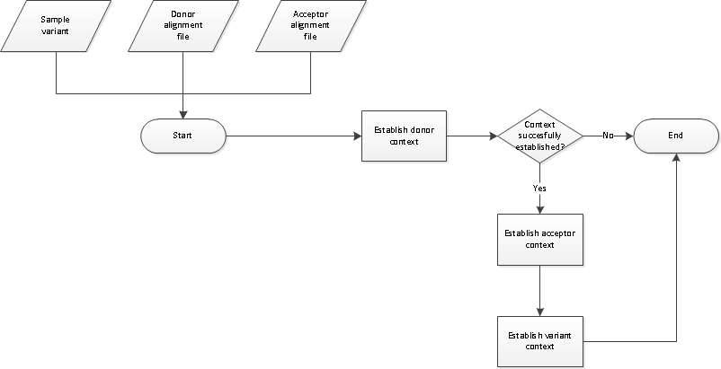
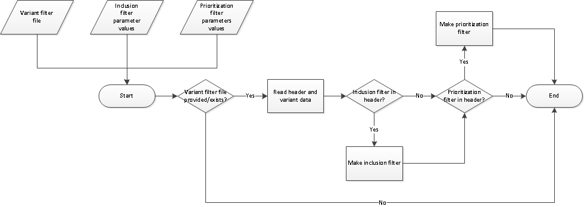
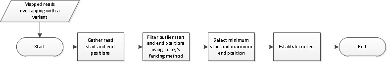
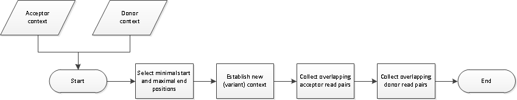
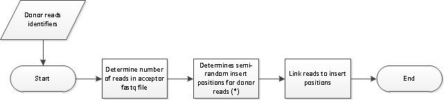

# VaSeBuilder Flowcharts

__Build FastQ__ 

  

__Build sample map__ 

  

__Build variant context set (BVCS)__ 

  

__BVCS Process sample__ 

  

__BVCS: Process variant__ 

  

__Create variant filters__ 

  

__Determine context__ 

  

__Determine variant context__ 

  

__Donor insert positions__ 

  
